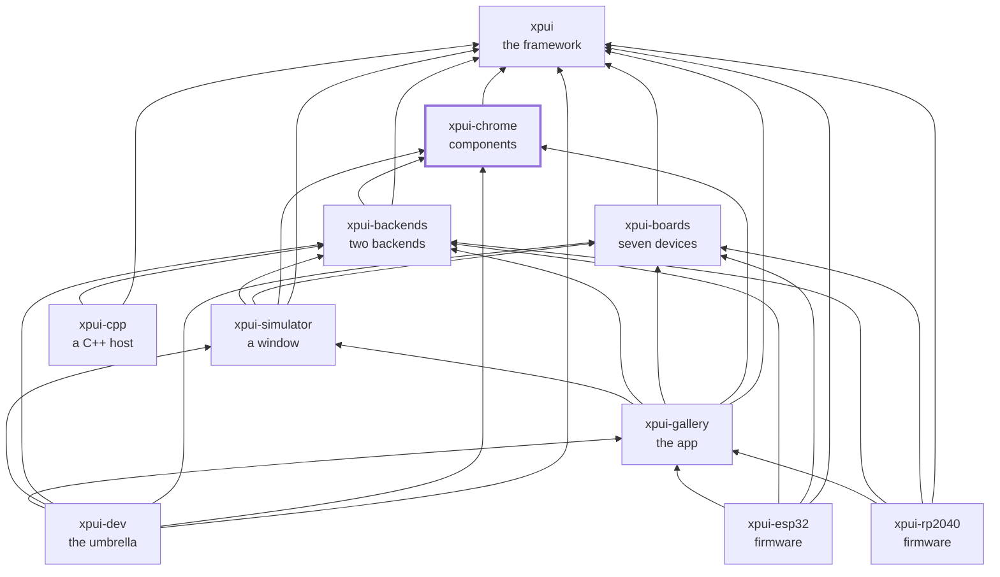

# `xpui-chrome`

> ⚠️ **Under heavy development.** Not production-ready. The API can break
> without notice. Use at your own risk.

[](https://github.com/XPUI-Framework/xpui-chrome/actions/workflows/ci.yml) [](LICENSE)

The eight themed components [`xpui`](https://github.com/XPUI-Framework/xpui-framework)
asks a backend to paint — a list, a dialog, a slider, a progress bar, a
header, a sub-header, a button-hint bar and a scroll indicator — painted from
drawing primitives alone. A backend sitting on a *drawing* library has nothing
to answer `xpui`'s `Chrome` trait with, and would otherwise have to write a
widget toolkit before it could show anything; this crate is that toolkit, once, for all of them.
`no_std`, and it depends on `xpui` and nothing else.

## Using it

```toml
[dependencies]
xpui-chrome = { git = "https://github.com/XPUI-Framework/xpui-chrome", branch = "main" }
```

Your backend implements `Canvas`, `TextMetrics`, `InputSource` and `Clock` —
the contract is [`docs/host.md`](https://github.com/XPUI-Framework/xpui-framework/blob/main/docs/host.md)
— and one macro writes the whole of the fifth, `Chrome`:

```rust
# struct MyBackend;
# impl MyBackend { fn flush(&self) {} }
use xpui_chrome::{KeyRow, Labels, Metrics};

static METRICS: Metrics = Metrics::DEFAULT;
static LABELS: Labels = Labels::ENGLISH;
static KEYS: KeyRow = KeyRow::READER;

xpui_chrome::plain_chrome! {
    for MyBackend,
    metrics: |_backend| &METRICS,
    labels: |_backend| &LABELS,
    keys: |_backend| &KEYS,
    request_update: |backend| backend.flush(),
}
```

Four things go in because four parties own them: the metrics come from
whoever knows the panel, the labels from whoever knows the user's language,
the key row from the hardware, and `request_update` from the one thing that
can get pixels onto a panel — the backend.
[docs/components.md](docs/components.md) says what each is and why they are
closures. Nothing is on crates.io yet, which is why the dependency above is
a `git` URL.

## Checking it

```bash
./build-and-test.sh
```

The checks themselves are in [`xtask/`](xtask/) — this repository's own list,
in Rust, holding nothing it does not run. `./build-and-test.sh fix` formats
in place first. How a change is reviewed is in
[docs/contributing.md](docs/contributing.md).

## Where next

| | |
|---|---|
| [docs/components.md](docs/components.md) | the eight components, the four things a backend passes in, and the metrics, labels and key row they paint from |
| [docs/design.md](docs/design.md) | the arguments behind choices the code states in one sentence |
| [docs/contributing.md](docs/contributing.md) | building it, the gate, the five review steps, and how a commit is written |

## Where it sits

Every arrow is a dependency in a `Cargo.toml`, and they all point inward
toward `xpui`, which depends on nothing at all. That is the rule the
organisation is arranged around: a backend can be written without the framework
knowing it exists, and a firmware reaches whatever it needs directly rather
than through whoever happens to sit above it.



## License

MIT — see [LICENSE](LICENSE). Copyright (c) 2026 Thiago Holanda.
